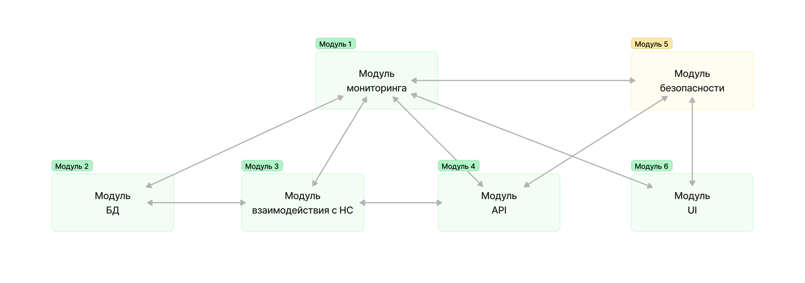

# ML System Design Doc - HR Tech Solution MVP 1
    
> ## Термины и пояснения
> - Итерация - это все работы, которые совершаются до старта очередного пилота  
> - БТ - бизнес-требования 
> - EDA - Exploratory Data Analysis - исследовательский анализ данных  
> - `Product Owner`,  `Data Scientist` - роли, которые заполняют соответствующие разделы 
> - В этом документе роль `Data Scientist` совмещает в себе компетенции классического `Data Scientist` с упором на исследования и `ML Engineer` & `ML Ops` роли с акцентом на продуктивизацию моделей
> - **!TODO: Проработать роли в команде AB Group** 

### 1. Цели и предпосылки 
#### 1.1. Зачем идем в разработку продукта?  

- Бизнес-цели: 
  - Разработка инновационной HR Tech платформы, способной предоставить компаниям и соискателям полезные инсайты и рекомендации на основе анализа данных для повышения эффективности HR-процессов.
  - Сокращение временных затрат на ручную обработку данных, содержащих информацию о сотрудниках и вакансиях.
  - Предоставление полезной аналитики по вакансиям для оптимизации процессов управления компанией
  - Оптимизация закрытия потребностей в персонале, создание персонализированных рекомендаций для соискателей для повышения уровня компетенций и мотивированности сотрудников компании
- Критерии успеха: 
  - Увеличение количества заказчиков
  - Улучшение показателей эффективности HR-процессов у клиентов
  - Преоблдадание положительных качества отзывов от пользователей системы.

#### 1.2. Бизнес-требования и ограничения  

- Краткое описание БТ: Разработать модель предсказания заработной платы сотрудников на основе их характеристик и выделить группы схожих работников для создания персонализированных рекомендаций. 

**!TODO: Добавить перед показом стейкхолдеру! Ссылка на подробные документы с бизнес-требованиями: [ссылка].**

Подробное описание бизнес-ограничений, таких как бюджетные ограничения и сроки реализации, включает в себя следующие аспекты:

- **Бюджетные ограничения**:
   - **Максимальный бюджет проекта**: Определение максимальной суммы, которую компания готова выделить на реализацию проекта. Это включает в себя затраты на разработку, внедрение и обслуживание системы, а также расходы на необходимые ресурсы и персонал.
   - **Ограничения на дополнительные затраты**: Определение возможности дополнительных затрат в случае необходимости расширения функциональности или решения возникших проблем. Эти ограничения могут включать в себя утверждение дополнительных бюджетов на основе оценки бизнес-преимуществ и рисков.
   - **Ограничения на затраты на обслуживание**: Установление пределов на расходы на обслуживание и поддержку системы после ее внедрения. Это позволяет контролировать операционные издержки и обеспечить эффективное использование ресурсов.

- **Сроки реализации**:
   - **Общий срок реализации проекта**: Определение временного рамки для завершения всех этапов проекта, включая анализ требований, разработку, тестирование и внедрение системы. Этот срок должен соответствовать бизнес-потребностям и ограничениям на рынке.
   - **Деление проекта на этапы и майлстоуны**: Разделение проекта на отдельные этапы с определением ключевых моментов и достижений, которые должны быть завершены в определенные сроки. Это позволяет управлять процессом реализации и контролировать прогресс.
   - **Временные ограничения для конкретных функций или модулей**: Установление временных ограничений на разработку и внедрение конкретных функций или модулей системы. Это помогает оптимизировать процесс и ускорить вывод на рынок ключевых возможностей.

Адекватное управление бюджетными ограничениями и сроками реализации позволяет обеспечить успешное завершение проекта в рамках выделенных ресурсов и времени, а также достижение поставленных бизнес-целей.
- Критерии успеха итерации: Разработка модели с точностью не менее 85%, интеграция модели в платформу, положительная обратная связь от тестовых пользователей.

#### 1.3. Что входит в скоуп проекта/итерации, что не входит   

- Входит в скоуп: Разработка модели предсказания заработной платы сотрудников, выделение групп схожих работников.  
- Не входит в скоуп: Реализация ML-моделей для других задач, например, автоматизация процессов подбора персонала. 
- Технический долг: Доработка интерфейса для улучшения пользовательского опыта, оптимизация скорости работы модели.

#### 1.4. Предпосылки решения  
- Повышение уровня демотивации сотрудников в компаниях, повышение уровня текучки кадров.
- Выделение характеристик сотрудников (возраст, пол, уровень образования, опыт работы) стал доступен для предсказания заработной платы. 
- Группировка работников по схожим характеристикам для создания персонализированных рекомендаций

### 2. Методология

#### 2.1. Постановка задачи  

Для решения задачи в области HR Tech необходимо разработать модели для job-червисов и HRM систем, включая две подзадачи:

1. Разработка модели предсказания заработной платы сотрудников на основе их характеристик, таких как возраст, уровень образования, опыт работы, с целью предоставления работодателям полезной аналитики по вакансиям и эффективного закрытия потребностей в персонале.
2. Выделение групп схожих работников на основе характеристик, таких как возраст, пол, уровень образования, опыт работы, заработная плата и статус "сеньора", для формирования более адресных рекомендательных систем.

#### 2.2. Блок-схема решения  

#### 2.3. Этапы решения задачи

*Этап 1 - Подготовка данных*

- Для моделирования заработной платы необходимо иметь данные о сотрудниках: возраст, уровень образования, опыт работы, заработная плата.
  
| Название данных  | Есть ли данные в компании | Требуемый ресурс для получения данных | Проверено ли качество данных |
| ------------- | ------------- | ------------- | ------------- |
| Данные сотрудников | HRM система | HR, DE/DS | Да |
| Статистика о вакансиях| HH/LinkedIn/... | HR, DE/DS | Нет |
**!TODO: Проработать, какие еще данные понадобятся**

- Описание результата этапа: таблицы с данными о сотрудниках, подготовленные для дальнейшего анализа.

*Этап 2 - Подготовка прогнозных моделей*

- Формирование выборки для обучения, тестирования и валидации, включая целевую переменную - заработную плату.
- Определение целевой метрики: вероятнее всего -- R2, RMSE.
- Разработка модели предсказания заработной платы на основе характеристик сотрудников.
- Необходимый результат: модель, способная предсказывать целевую заработную плату на основе собранных и агрегированных данных о сотрудниках.
- Риски: несбалансированность данных, выбросы, переобучение модели.
- Проведение бизнес-проверки: сравнение предсказанных значений с реальными данными для оценки точности модели с привлечением HR специалиста компании.

*Этап 3 - Интерпретация моделей*

- Разработка методов интерпретации модели для понимания, как влияют различные характеристики сотрудников на их заработную плату.
- Проверка статистической значимости коэффициентов модели, возможно корректировка.
- Предусмотрение бизнес-проверки: Проведение оценки интерпретируемости модели с точки зрения HR процессов.

*Этап 4 - Интеграция бизнес правил*

- Разработка бизнес-правил на основе результатов моделирования и интерпретации моделей.
- Интеграция бизнес-правил в процессы HRM системы для внедрения автоматического (на начальных этапах возможно автоматизированного) анализа и предоставления рекомендаций по заработной плате.

*Этап 5 - Подготовка инференса модели по итерациям*

- Разработка инференса модели для ее использования в реальном времени.
- Итеративное улучшение модели на по результатам сбора обратной связи от пользователей и результатов бизнес-проверки.

*Этап 6 - Разработка оптимизатора*

- Разработка оптимизатора для выбора наиболее подходящей модели и ее параметров.
- Оценка качества модели на тестовых данных и выбор оптимального набора параметров.

*Этап 7 - Подготовка отчета для бизнеса*

- Подготовка отчета о результатах моделирования и интерпретации для бизнеса.
- Согласование дальнейших шагов на основе полученных результатов и рекомендаций.

*Этап 8 - Разработка прототипа API*
- Разработка прототипа API для получения результатов работы модели. 
- Демонстрация прототипа
- Согласование дальнейших шагов на основе полученных результатов и рекомендаций.
  
### 3. Подготовка пилота  

При подготовке пилота стоит учесть, что максимальные мощности для ДЕМО не нужны, достаточно заложить в систему возможность масштабирования при необходимости. Позволит сэкономить на старте финансы и снизить риск потери всех средств при провале пилота.

#### 3.1. Способ оценки пилота  

- Проведение пилота будет осуществлено через запуск экспериментов на небольшом наборе данных, с последующей оценкой результатов. Процессом управляет `Product Owner` совместно с `Data Scientist` из AB Group. Оценка эффективности будет производиться на основе метрик качества модели и достижения целей, определенных бизнес-задачами.

#### 3.2. Что считаем успешным пилотом  

- Успешным пилотом считается достижение следующих результатов:
  - Улучшение точности модели предсказания заработной платы сотрудников на тестовом наборе данных не менее чем на 10% по сравнению с базовым уровнем.
  - Создание кластеров схожих работников, которые демонстрируют высокую внутригрупповую схожесть и различие с другими группами.
  - Демонстрация применимости модели и кластеризации для персонализированных рекомендаций и оптимизации процесса подбора персонала.

#### 3.3. Подготовка пилота  

- Ожидаемые затраты на вычисления уже просчитаны и соответствуют доступным ресурсам. На этапе расчетов ожидаемой вычислительной сложности было выявлено, что наши вычислительные ресурсы позволяют провести пилот с учетом предполагаемых моделей и алгоритмов. В случае необходимости дополнительных ресурсов, они будут выделены в соответствии с бюджетом и потребностями эксперимента.  

### 4. Внедрение

#### 4.1. Архитектура решения   

- Архитектура решения будет включать сервисы для предсказания заработной платы сотрудников и кластеризации работников. Методы API будут предоставлены для взаимодействия с этими сервисами. Развертывание и масштабирование осуществляется командой.  

#### 4.2. Описание инфраструктуры и масштабируемости 

- Для внедрения системы выбрана инфраструктура с использованием облачных ресурсов, таких как AWS или Google Cloud Platform. Это обеспечивает гибкость и масштабируемость системы в зависимости от изменяющихся потребностей.  

#### 4.3. Требования к работе системы  

- SLA: Система должна обеспечивать отклик на запросы пользователей не более чем за 0.5 секунды для 95% запросов. Для 99% запросов время отклика не должно превышать 1 секунду. Данные значения позволят обеспечить быструю реакцию системы на запросы пользователей и удовлетворить их ожидания относительно скорости обработки запросов.

- Пропускная способность: Система должна быть способна обрабатывать до 1000 запросов от пользователей в секунду без значительного увеличения времени отклика или снижения производительности. Это позволит системе эффективно обрабатывать большие объемы данных и поддерживать работоспособность при активном использовании.

- Задержка: Максимальная задержка между отправкой запроса пользователем и получением ответа от системы должна составлять не более 0.2 секунды. Это обеспечит быструю реакцию системы на действия пользователей и создаст позитивный пользовательский опыт, улучшая общую удовлетворенность клиентов.

#### 4.4. Безопасность системы  

- Система должна быть защищена от потенциальных уязвимостей с помощью регулярного аудита безопасности и применения соответствующих мер защиты данных.  

#### 4.5. Безопасность данных  

- Все операции с данными должны соответствовать требованиям законодательства о персональных данных, таким как Федеральный закон № 152 "О персональных данных". Данные должны храниться и передаваться в зашифрованном виде, обеспечивая их защиту от несанкционированного доступа и утечек. Доступ к данным должен быть строго ограничен и контролируем с целью предотвращения несанкционированного использования или распространения персональной информации.

#### 4.6. Издержки  

Расчет издержек на работу системы будет включать следующие составляющие:

- Затраты на облачные ресурсы: Оценка стоимости использования облачных ресурсов, таких как вычислительные мощности, хранилища данных и сетевые ресурсы. Эти затраты будут учитывать как базовые стоимости использования ресурсов, так и дополнительные расходы, связанные с масштабированием и изменением потребностей системы.

- Трудозатраты на обслуживание: Оценка необходимого количества времени и усилий, которые потребуются для обслуживания и поддержки системы. Это включает в себя работу системных администраторов, DevOps-инженеров, инженеров по обеспечению безопасности и других специалистов, ответственных за непрерывную работу и обновление системы.

- Трудозатраты на развитие системы: Оценка времени и ресурсов, необходимых для разработки новых функций, улучшений и исправлений в системе. Это включает в себя работу программистов, аналитиков данных, тестировщиков и других специалистов, занятых в разработке и сопровождении системы.

- Издержки на работу системы будут рассчитаны путем суммирования всех этих затрат в ежемесячном или годовом периоде, в зависимости от временного горизонта расчета. Такой подход позволит оценить общие затраты на обслуживание и развитие системы и определить их влияние на бюджет проекта.

#### 4.7. Integration points  

- Описаны методы API и взаимодействие между сервисами для обеспечения интеграции системы с другими приложениями и сервисами.  

#### 4.8. Риски  

В рамках описания рисков и неопределенностей, а также предложения мер по их снижению или управлению, следует учитывать следующие аспекты:

- Технические риски:

  - Неэффективная интеграция существующих систем: Возможность неполной или неудовлетворительной интеграции новой системы с существующими инфраструктурой и приложениями. Для снижения этого риска необходимо провести тщательное предварительное планирование и анализ требований к интеграции, а также предварительные тесты на песочнице.
  - Технические сбои и отказы: Риск возникновения сбоев и отказов в работе системы из-за программных или аппаратных проблем. Для управления этим риском необходимо регулярно проводить тестирование на прочность и резервное копирование данных.
- Бизнес-риски:

  - Неудовлетворение потребностей пользователей: Риск недостаточной адаптации системы к потребностям пользователей или бизнес-задачам. Для снижения этого риска необходимо установить регулярный обмен информацией с заказчиками и пользовательским сообществом, а также проводить тестирование пользовательского опыта.
  - Финансовые риски: Возможность превышения бюджета проекта из-за неожиданных затрат или увеличения стоимости обслуживания системы. Для управления этим риском необходимо внимательное финансовое планирование и мониторинг затрат.
- Правовые риски:

  - Нарушение законодательства о защите данных: Риск нарушения законодательства о персональных данных, таких как GDPR или Федеральный закон № 152 "О персональных данных". Для управления этим риском необходимо строго соблюдать все требования по защите данных и регулярно проводить аудиты безопасности.
  - Интеллектуальная собственность и лицензирование: Риск нарушения прав интеллектуальной собственности или лицензионных соглашений при использовании сторонних компонентов или программного обеспечения. Для управления этим риском необходимо тщательно проверять соответствие всех используемых компонентов лицензионным соглашениям и правовым требованиям.
  - Для снижения рисков и неопределенностей рекомендуется разработать план действий по управлению рисками, который включает в себя идентификацию рисков, оценку их влияния и вероятности, разработку мер по их предотвращению или смягчению, а также мониторинг и регулярное обновление плана.

